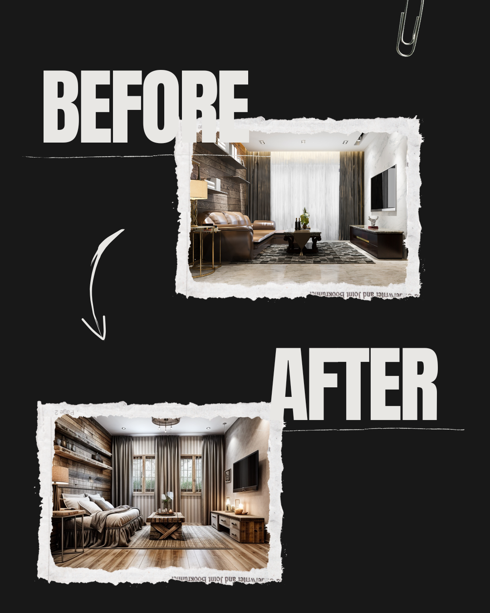

# AI Room Redesign (RestNest)



Welcome to **RestNest**, an AI-powered interior redesign platform that lets users upload images of rooms and receive customized redesigns based on their preferences and prompts. This README provides detailed instructions on how to install, configure, and run the project, as well as an overview of the technologies and dependencies used.

---

## Features

- **AI-Driven Redesign**: Upload a room image, provide your design preferences, and get a reimagined design tailored to your needs.
- **User-Friendly Interface**: Intuitive UI built with ShadCN UI and other modern tools.
- **Secure Payment Integration**: Razorpay-powered checkout for additional services.
- **Authentication**: Seamless user authentication with Clerk.
- **Cloud Integration**: Image management with Cloudinary.
- **Database Management**: Serverless database using Neon and Drizzle ORM.
- **Responsive Design**: Optimized for various devices.

---

## Installation

### 1. Clone the Repository

```bash
git clone https://github.com/yourusername/ai-room-redesign.git
cd ai-room-redesign
```

### 2. Install Dependencies

Ensure you have [Node.js](https://nodejs.org/) (v16+) and [npm](https://www.npmjs.com/) installed. Then run:

```bash
npm install
```

### 3. Environment Variables

Create a `.env.local` file in the root directory and add the following variables:

```env
NEXT_PUBLIC_DATABASE_URL=
NEXT_PUBLIC_CLERK_PUBLISHABLE_KEY=
CLERK_SECRET_KEY=
NEXT_PUBLIC_CLERK_SIGN_IN_URL=/sign-in
NEXT_PUBLIC_CLERK_SIGN_UP_URL=/sign-up
NEXT_PUBLIC_CLERK_API_URL=
NEXT_PUBLIC_FIREBASE_API_KEY=
NEXT_PUBLIC_CLOUD_NAME=
NEXT_PUBLIC_UPLOAD_PRESET=
NEXT_PUBLIC_REPLICATE_API_TOKEN=
NEXT_PUBLIC_CLOUD_API_KEY=
NEXT_PUBLIC_CLOUD_API_SECRET=
NEXT_PUBLIC_DB_URL=
RAZORPAY_KEY_ID=
RAZORPAY_KEY_SECRET=
NEXT_PUBLIC_RAZORPAY_KEY_ID=
```

Fill these variables with the appropriate values for your project. Contact the respective service providers for API keys and credentials.

### 4. Start the Development Server

```bash
npm run dev
```

Navigate to `http://localhost:3000` in your browser to view the application.

---

## Usage

1. **Sign Up/In**: Use the Clerk-powered authentication system to register or log in.
2. **Upload an Image**: Navigate to the redesign tool, upload an image of your room, and provide prompts for the AI.
3. **View Redesigns**: AI processes your input and displays the redesigned room.
4. **Checkout**: Use Razorpay for premium features or services.
5. **Save and Share**: Download or share your redesigned room.

---

## Technologies Used

- **Frontend**: [Next.js](https://nextjs.org/), [Tailwind CSS](https://tailwindcss.com/), [ShadCN UI](https://shadcn.dev/)
- **AI Integration**: [Replicate](https://replicate.com/)
- **Authentication**: [Clerk](https://clerk.dev/)
- **Cloud Storage**: [Cloudinary](https://cloudinary.com/)
- **Database**: [Neon DB](https://neon.tech/), [Drizzle ORM](https://orm.drizzle.team/)
- **Payment Gateway**: [Razorpay](https://razorpay.com/)
- **UI Components**: Radix UI, Material UI, DaisyUI
- **Other Tools**: Framer Motion, React Toastify, and Axios

---

## Project Structure

```
├── components/       # Reusable React components
├── pages/            # Next.js pages
├── public/           # Static assets
├── styles/           # Global styles
├── utils/            # Utility functions
├── .env.local        # Environment variables (not included in repo)
└── ...
```

---

## Scripts

- `npm run dev`: Start the development server.
- `npm run build`: Build the application for production.
- `npm run start`: Start the production server.
- `npm run lint`: Lint the codebase.

---

## Dependencies

For a full list of dependencies, refer to the `package.json` file. Notable dependencies include:

- [@clerk/nextjs](https://clerk.dev/)
- [drizzle-orm](https://orm.drizzle.team/)
- [Replicate](https://replicate.com/)
- [Razorpay](https://razorpay.com/)
- [Cloudinary](https://cloudinary.com/)

---

## Contribution

We welcome contributions! Please fork the repository, make your changes, and submit a pull request.

---

## Contact

For questions or support, contact:

- **Developer**: Jubin Thomas
- **Email**: [jubinthomasind@gmail.com](mailto:jubinthomasind@gmail.com)
- **GitHub**: [github.com/jubin2003](https://github.com/jubin2003)

---


